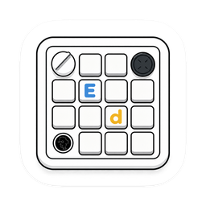

[English](README.md) · [简体中文](public/README.zh-CN.md)

# Ed.Board

**Your Micro. Your workflow.**

A native macOS companion and firmware for AI Micro.
Keys, layers, lighting and an eight-direction joystick — configured in one place.

`macOS 14+` · `Apple Silicon` · `USB + Bluetooth`

[Get started](#get-started) · [Daily use](#daily-use) · [Firmware](#firmware) · [Help](#help) · [Roadmap](#roadmap)

---

## Small board. More control.

| Control | Make it yours |
| --- | --- |
| Keys & knob | Assign shortcuts and media controls, open apps, URLs or files, and insert text. Add your own names and icons. |
| Layers | Keep up to 16 layers, with up to 6 Favorites for touch switching and searchable Extended layers. Inherit actions across both groups. |
| Joystick | Map eight directions. A compact desktop wheel shows your choices as you move; return to centre to act or cancel. |
| Lighting | Adjust key and outer lighting, with per-layer colours and input effects. |
| Menu bar | Check the connection and battery, open the editor, or leave Ed.Board running in the background. |

The Codex layer retains native Codex control of its knob and joystick; the desktop wheel stays hidden for those controls.

## Get started

**Requirements:** an Apple Silicon Mac running macOS 14 or later, and an **AI Micro Board3 with ESP32-S3 N16R8** and compatible firmware. Other board revisions are not covered. The App interface is currently English.

### 1. Install

When a release is available, download the App **DMG** from this repository’s **Releases** page. Open it and drag **Ed.Board.app** onto the **Applications** shortcut. Eject the disk image, then open Ed.Board from Applications. To replace an older version, choose **Quit Ed.Board** first.

The current build has no Developer ID signature or Apple notarization. If macOS blocks it, review [Apple’s guidance on opening downloaded apps](https://support.apple.com/en-au/102445). Only approve a copy whose source you trust; installation on other Macs still needs verification.

### 2. Connect

- **USB:** connect with a data-capable cable and open Ed.Board. If needed, go to **Settings → Connection**, choose the USB port and select **Connect USB**.
- **Bluetooth:** on Ed.Board firmware, hold the touch area for **3 seconds** to open a **60-second** pairing window. Pair the keyboard in macOS Bluetooth settings, allow Ed.Board Bluetooth access, then choose **Connect Bluetooth** in the App. A key or knob press cancels the pairing window.

Ed.Board reads the connected keyboard’s configuration. A fresh installation does not include anyone else’s app bindings, text actions or custom images.

### 3. Make it yours

Open **Keymap**, choose a Favorite or search the **Extended** sidebar, and select a key, knob or joystick direction to edit. Choose **Save changes** to apply your work, or **Discard changes** to return to the saved configuration.

Choose **Media Control** in Actions, then select **Volume Up**, **Volume Down**, **Mute**, **Play / Pause**, **Previous Track** or **Next Track**. Each knob step triggers one action; joystick actions execute on return to centre.

Use the **+** beside Favorites or Extended to add a layer; use **Editing → •••** or a layer’s context menu to move it between groups. Keep 1–6 Favorites. The touch area cycles only Favorites; Extended layers leave the three layer indicators off.

Link a layer to an application to switch automatically while that app is active. Selecting a layer in the editor only changes what you are editing, not the keyboard’s active layer. An unlinked Extended layer is available for editing only. Touching from an active Extended layer returns to the first Favorite; the same automatic match stays dismissed until the match changes or its session expires.

## Daily use

- **Close the window:** Ed.Board stays in the menu bar and leaves the Dock. Reopen it from the menu bar or Applications.
- **Start quietly:** enable **System → Launch at Login** to start in the background.
- **Keep host actions available:** app launching, opening files or URLs, text insertion, automatic app matching and the desktop joystick wheel need Ed.Board running.
- **Quit the App:** saved shortcuts and media controls still work through the keyboard. Host actions and the desktop wheel stop until Ed.Board is running again.
- **Insert text:** allow Accessibility access when prompted. Text insertion depends on the target app; shortcuts are simultaneous key combinations, not multi-step macros.

## Firmware

This source tree targets **App 0.6.0 (32) / firmware 0.6.0**, not yet released. Downloaded releases may differ; use the App and firmware supplied together. Expanded layers require the matching new firmware.

Inspired by [AI Micro](https://micro.diyshare.cn/); portions of the firmware are adapted from its code, with the original [MIT license and copyright notice](firmware/usb-probe/src/vendor/LICENSE) retained.

For a recognized, compatible keyboard, connect over **USB**, open **System → Device & Firmware**, and follow **Install required firmware** when offered. Close serial monitors and keep USB connected until verification finishes. The updater backs up settings before writing and does not erase the whole chip. Existing layers retain their order and become Favorites. After saving in 0.6.0, older firmware cannot read the new snapshot; use a verified backup for a deliberate downgrade.

This is an updater for compatible devices, **not a universal factory installer**. A keyboard running unrecognized firmware may need a separate initial installation procedure; do not flash this package onto a different board or bypass a compatibility check.

## Help

**macOS says connected, but Ed.Board does not?** Keyboard input and App management use separate connections. Check **Settings → Connection** and retry the App connection. A working Bluetooth keyboard alone does not confirm management access.

**Bluetooth stops connecting after the media-control upgrade?** The new HID report can leave macOS using cached Bluetooth services. Connect over USB, forget **Codex Micro** in macOS Bluetooth settings, then choose **Clear Pairing…** in the App’s **Bluetooth Pairing** section. Unplug USB, hold touch for 3 seconds and pair again. Layer settings are preserved. If the old “Pairing cleared” message remains after **Paired / Ready** appears, click **Refresh Status**; do not clear pairing again.

**Input temporarily unresponsive after deep sleep?** This intermittent issue remains under investigation. Release all controls and allow time for recovery. A connected App does not by itself confirm input readiness.

**Battery says Unknown?** The App may not have received a valid reading yet. Check its connection first. The percentage is a voltage-based estimate, not a precise remaining-runtime prediction.

**Where is my data?** Mac-side settings live in `~/Library/Application Support/Ed.Board/Settings/`; firmware recovery files live in `~/Library/Application Support/Ed.Board/Firmware/`. Logs are stored separately in `~/Library/Logs/Ed.Board/` and rotate automatically. Detailed diagnostics stop automatically after 30 minutes.

**Found a problem or have an idea?** Open an issue with your App and firmware versions, macOS version, USB/Bluetooth connection type, and steps to reproduce. Remove personal paths, device identifiers and action content before sharing logs or screenshots. Small fixes and focused improvements are welcome.

For hardware information and original firmware resources, also visit [AI Micro](https://micro.diyshare.cn/). For Ed.Board-specific issues, please use this repository’s issues.

## Roadmap

Future exploration, guided by community feedback:

- A Chinese App interface.
- Multi-step macros and other actions based on community feedback.
- Firmware support for remembering Bluetooth pairings with multiple computers.

These are exploratory directions, without a committed release schedule.

## Development & license

See the [development guide](public/DEVELOPMENT.md) to build from source. Original Ed.Board code is licensed under **GNU GPL version 3 only (GPL-3.0-only)**; see [LICENSE](LICENSE). Third-party code and assets retain their own terms, described in [Third-party notices](public/THIRD_PARTY_NOTICES.md).
